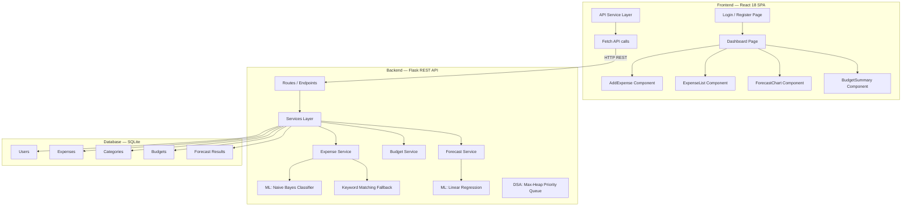
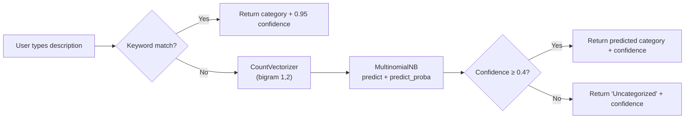

# 💸 SmartSpend (Finora) — Complete Project Overview

> **SmartSpend** is a full-stack, AI-powered intelligent expense management system that combines **Machine Learning**, **Data Structures & Algorithms**, and **Database Management** into a cohesive personal finance application.

---

## 📌 Table of Contents

1. [Project Summary](#-project-summary)
2. [Technology Stack](#-technology-stack)
3. [System Architecture](#-system-architecture)
4. [Directory Structure](#-directory-structure)
5. [Backend — Detailed Breakdown](#-backend--detailed-breakdown)
   - [Application Factory & Configuration](#application-factory--configuration)
   - [Database Models (ORM)](#database-models-orm)
   - [API Routes & Endpoints](#api-routes--endpoints)
   - [Services Layer](#services-layer)
   - [Machine Learning Models](#machine-learning-models)
   - [DSA — Priority Queue](#dsa--priority-queue)
   - [Schemas (Serialization/Validation)](#schemas-serializationvalidation)
   - [Utilities](#utilities)
6. [Frontend — Detailed Breakdown](#-frontend--detailed-breakdown)
   - [App Entry & Routing](#app-entry--routing)
   - [Pages](#pages)
   - [Components](#components)
   - [Services (API Client)](#services-api-client)
   - [Custom Hooks](#custom-hooks)
   - [Styling & Design System](#styling--design-system)
7. [Database Layer](#-database-layer)
8. [Data Assets](#-data-assets)
9. [Testing](#-testing)
10. [Documentation](#-documentation)
11. [Feature Inventory](#-feature-inventory)
12. [API Reference](#-api-reference)
13. [ML Pipeline Details](#-ml-pipeline-details)
14. [DSA Implementation Details](#-dsa-implementation-details)
15. [Security Features](#-security-features)
16. [Running the Project](#-running-the-project)

---

## 🧾 Project Summary

| Attribute | Detail |
|---|---|
| **Project Name** | SmartSpend (branded as **Finora** in the UI) |
| **Type** | Full-Stack Web Application |
| **Domain** | Personal Finance / Expense Management |
| **Core Pillars** | Machine Learning · DSA · Database Management |
| **Backend** | Python / Flask REST API |
| **Frontend** | React 18 SPA |
| **Database** | SQLite (via SQLAlchemy ORM) |
| **ML Models** | Naive Bayes (category classification) + Linear Regression (spending forecast) |
| **DSA** | Max-Heap Priority Queue (top-expense tracking) |
| **Auth** | JWT (JSON Web Tokens) with bcrypt password hashing |

---

## 🛠 Technology Stack

### Backend
| Technology | Version | Purpose |
|---|---|---|
| Python | 3.x | Runtime |
| Flask | 3.0.0 | Web framework |
| Flask-SQLAlchemy | 3.1.1 | ORM / Database |
| Flask-JWT-Extended | 4.6.0 | JWT authentication |
| Flask-CORS | 4.0.0 | Cross-origin resource sharing |
| Flask-Marshmallow | 0.15.0 | Serialization / deserialization |
| Marshmallow | 3.21.1 | Schema validation |
| Marshmallow-SQLAlchemy | 0.29.0 | SQLAlchemy schema integration |
| scikit-learn | 1.4.0 | Machine learning (Naive Bayes, Linear Regression) |
| pandas | 2.2.0 | Data processing |
| numpy | 1.26.4 | Numerical computing |
| bcrypt | 4.1.2 | Password hashing |
| joblib | 1.3.2 | Model serialization |
| python-dotenv | 1.0.0 | Environment variables |

### Frontend
| Technology | Version | Purpose |
|---|---|---|
| React | 18.2.0 | UI framework |
| React DOM | 18.2.0 | DOM rendering |
| React Router DOM | 6.22.0 | Client-side routing |
| React Scripts | 5.0.1 | Build tooling (Create React App) |

### Design
| Element | Detail |
|---|---|
| Fonts | Fraunces (serif headings) + Plus Jakarta Sans (body) |
| Theme | Dark mode with glassmorphism design |
| Color Palette | Muted earthy tones — warm golds, teal accents, slate blues |
| Animations | fadeInUp, spin, summarySwitchIn, autoDismissFade |

---

## 🏗 System Architecture



---

## 📁 Directory Structure

```
SmartSpend/
├── .gitignore
├── README.md
│
├── backend/
│   ├── .env                              # Environment configuration
│   ├── requirements.txt                  # Python dependencies
│   ├── run.py                            # Application entry point
│   ├── instance/
│   │   └── smartspend.db                 # SQLite database file
│   ├── venv/                             # Python virtual environment
│   └── app/
│       ├── __init__.py                   # Flask app factory + extension init
│       ├── config.py                     # Configuration classes (Dev/Prod)
│       ├── database.py                   # DB init/drop/reset utilities
│       ├── models.py                     # SQLAlchemy ORM models (5 models)
│       ├── routes.py                     # API route definitions (12 endpoints)
│       ├── dsa/
│       │   └── priority_queue.py         # MaxHeap + ExpensePriorityQueue
│       ├── ml_models/
│       │   ├── naive_bayes_model.py      # NB classifier with built-in training data
│       │   ├── train_naive_bayes.py      # CSV-based training script with evaluation
│       │   ├── linear_regression_model.py # Spending trend forecasting
│       │   ├── model.pkl                 # Serialized ML pipeline
│       │   ├── naive_bayes_model.pkl     # Alternate serialized model
│       │   └── vectorizer.pkl            # Serialized vectorizer
│       ├── schemas/
│       │   ├── expense_schema.py         # Expense Marshmallow schema
│       │   └── user_schema.py            # User Marshmallow schema
│       ├── services/
│       │   ├── expense_service.py        # Expense CRUD + ML prediction logic
│       │   ├── budget_service.py         # Budget CRUD + summary + suggestions
│       │   └── forecast_service.py       # Forecast orchestration service
│       └── utils/
│           ├── validators.py             # Input validation functions
│           └── helpers.py                # Currency formatting, date helpers
│
├── frontend/
│   ├── package.json                      # NPM configuration
│   ├── package-lock.json                 # Dependency lock
│   ├── node_modules/                     # NPM packages
│   ├── build/                            # Production build output
│   ├── public/
│   │   └── index.html                    # HTML shell
│   └── src/
│       ├── index.js                      # React entry point
│       ├── index.css                     # Global stylesheet (469 lines)
│       ├── App.js                        # Root component with routing
│       ├── pages/
│       │   ├── Login.jsx                 # Login / Register page
│       │   └── Dashboard.jsx             # Main dashboard with sidebar layout
│       ├── components/
│       │   ├── AddExpense.jsx            # Expense creation form
│       │   ├── ExpenseList.jsx           # Expense table with filters
│       │   ├── ForecastChart.jsx         # SVG spending trend chart
│       │   └── BudgetSummary.jsx         # Budget management UI
│       ├── services/
│       │   └── api.js                    # API client (auth, expenses, forecast, budget, dashboard)
│       └── hooks/
│           └── useAutoDismiss.js         # Auto-dismiss notification hook
│
├── database/
│   ├── schema.sql                        # DDL — 5 tables + seed categories
│   └── seed_data.sql                     # Sample test data for development
│
├── data/
│   ├── training_data.csv                 # ML training dataset (~300+ rows)
│   ├── sample_expenses.csv               # Sample expense transactions
│   ├── budget_limits.csv                 # Sample budget limit data
│   └── smartspend_users.csv              # User demographic dataset
│
├── tests/
│   ├── test_api.py                       # API endpoint tests (5 tests)
│   ├── test_ml.py                        # ML model tests (8 tests)
│   └── test_priority_queue.py            # DSA heap tests (5 tests)
│
└── docs/
    ├── api_documentation.md              # API documentation
    ├── architecture_diagram.png          # Architecture diagram image
    └── project_report.docx              # Project report document
```

---

## ⚙️ Backend — Detailed Breakdown

### Application Factory & Configuration

#### [`__init__.py`](file:///d:/SmartSpend/backend/app/__init__.py)
Creates the Flask application using the **Application Factory** pattern:
- Loads environment variables via `python-dotenv`
- Initializes extensions: **SQLAlchemy** (ORM), **JWTManager** (auth), **Marshmallow** (serialization), **CORS** (cross-origin)
- Configures `SECRET_KEY`, `SQLALCHEMY_DATABASE_URI`, `JWT_SECRET_KEY`, and `JWT_ACCESS_TOKEN_EXPIRES` (default: 24 hours)
- Registers the `main` blueprint from routes
- Auto-creates all database tables on startup via `db.create_all()`

#### [`config.py`](file:///d:/SmartSpend/backend/app/config.py)
Defines configuration classes:
- **`Config`** — Base config with SQLite URI, secret keys, debug flag
- **`DevelopmentConfig`** — Debug = True
- **`ProductionConfig`** — Debug = False

#### [`database.py`](file:///d:/SmartSpend/backend/app/database.py)
Utility functions for database lifecycle:
- **`init_db(app)`** — Create all tables
- **`drop_db(app)`** — Drop all tables
- **`reset_db(app)`** — Drop + recreate (full reset)

#### [`.env`](file:///d:/SmartSpend/backend/.env)
Environment variables:
```
FLASK_APP=run.py
FLASK_ENV=development
SECRET_KEY=smartspend_secret_key_2024
DATABASE_URL=sqlite:///smartspend.db
JWT_SECRET_KEY=jwt_smartspend_secret
DEBUG=True
```

#### [`run.py`](file:///d:/SmartSpend/backend/run.py)
Entry point that:
1. Creates the Flask app via factory
2. Pre-loads the ML model on startup
3. Starts the dev server on `0.0.0.0:5000` with debug mode

---

### Database Models (ORM)

Defined in [`models.py`](file:///d:/SmartSpend/backend/app/models.py) — **5 SQLAlchemy models**:

#### 1. User
| Column | Type | Constraints |
|---|---|---|
| `id` | Integer | Primary Key, Auto-increment |
| `name` | String(100) | NOT NULL |
| `email` | String(150) | UNIQUE, NOT NULL |
| `password_hash` | String(255) | NOT NULL |
| `created_at` | DateTime | Default: UTC now |

- **Relationships**: `expenses` (one-to-many, cascade delete), `budgets` (one-to-many, cascade delete), `forecasts` (one-to-many, cascade delete)
- **Methods**: `set_password(password)` — bcrypt hash; `check_password(password)` — bcrypt verify

#### 2. Category
| Column | Type | Constraints |
|---|---|---|
| `id` | Integer | Primary Key |
| `name` | String(50) | UNIQUE, NOT NULL |

- **Relationships**: `expenses` (one-to-many)
- **Seeded categories**: Food, Transport, Bills, Shopping, Entertainment, Health, Uncategorized

#### 3. Expense
| Column | Type | Constraints |
|---|---|---|
| `id` | Integer | Primary Key |
| `user_id` | Integer | FK → users.id, NOT NULL |
| `category_id` | Integer | FK → categories.id, NULLABLE |
| `description` | String(255) | NOT NULL |
| `amount` | Float | NOT NULL |
| `date` | Date | NOT NULL, Default: today |
| `predicted_category` | String(50) | ML prediction result |
| `confidence` | Float | ML confidence score |
| `created_at` | DateTime | Default: UTC now |

- **`to_dict()`** — Serializes to JSON with category name resolution (falls back to `predicted_category` if no category object)

#### 4. Budget
| Column | Type | Constraints |
|---|---|---|
| `id` | Integer | Primary Key |
| `user_id` | Integer | FK → users.id, NOT NULL |
| `category` | String(50) | NOT NULL |
| `monthly_limit` | Float | NOT NULL |
| `month` | Integer | NOT NULL (1-12) |
| `year` | Integer | NOT NULL |
| `created_at` | DateTime | Default: UTC now |

- **Unique constraint**: `(user_id, category, month, year)`

#### 5. ForecastResult
| Column | Type | Constraints |
|---|---|---|
| `id` | Integer | Primary Key |
| `user_id` | Integer | FK → users.id, NOT NULL |
| `predicted_month` | Integer | NOT NULL |
| `predicted_year` | Integer | NOT NULL |
| `predicted_amount` | Float | NOT NULL |
| `generated_at` | DateTime | Default: UTC now |

---

### API Routes & Endpoints

Defined in [`routes.py`](file:///d:/SmartSpend/backend/app/routes.py) — **12 REST endpoints** grouped into 5 sections:

| # | Method | Endpoint | Auth | Description |
|---|---|---|---|---|
| 1 | POST | `/api/register` | ❌ | Register a new user |
| 2 | POST | `/api/login` | ❌ | Login and get JWT token |
| 3 | POST | `/api/expenses` | ✅ | Add a new expense (auto ML categorization) |
| 4 | GET | `/api/expenses` | ✅ | Get all user expenses |
| 5 | DELETE | `/api/expenses/<id>` | ✅ | Delete a specific expense |
| 6 | GET | `/api/forecast` | ✅ | Get spending forecast |
| 7 | POST | `/api/budget` | ✅ | Create/set a budget |
| 8 | PUT | `/api/budget/<id>` | ✅ | Update an existing budget |
| 9 | DELETE | `/api/budget/<id>` | ✅ | Delete a budget |
| 10 | GET | `/api/budget/summary` | ✅ | Get budget vs actual summary |
| 11 | GET | `/api/dashboard` | ✅ | Aggregated dashboard data (period-aware) |
| 12 | GET | `/api/health` | ❌ | Health check |

#### Dashboard Endpoint — Special Logic
The `/api/dashboard` endpoint supports a **`period` query parameter** (`weekly`, `monthly`, `yearly`) and computes:
- **Current/previous period bounds** — Dynamic date range calculation
- **Total expenses** — Sum for the current period
- **Expense count** — Transaction count for the period
- **Trend calculation** — Percentage change vs previous period (`up`, `down`, `flat`)
- **Forecast value** — Period-appropriate forecasting (weekly mirrors current, monthly uses ML, yearly projects annual total)
- **Budget summary** — Live budget-vs-spending comparison

---

### Services Layer

#### [`expense_service.py`](file:///d:/SmartSpend/backend/app/services/expense_service.py)
Core expense business logic:

- **`predict_category(description)`** — Dual-strategy categorization:
  1. **Keyword matching** (first priority) — 60+ keywords mapped to 6 categories with 0.95 confidence
  2. **ML model fallback** — Naive Bayes pipeline prediction with probability-based confidence
  3. **Low-confidence handling** — Predictions below 40% confidence → "Uncategorized"
- **`add_expense(user_id, data)`** — Full expense creation pipeline:
  1. Validates description and amount
  2. Parses date (supports `YYYY-MM-DD` and `DD-MM-YYYY`)
  3. Predicts category via ML
  4. Finds or creates the Category record
  5. Persists the Expense
- **`get_user_expenses(user_id)`** — Retrieves expenses ordered by date desc, then created_at desc
- **`delete_expense(user_id, expense_id)`** — Ownership-verified delete

**Canonical Category Mapping**: Normalizes user input like "food" → "Food", "travel" → "Transport"

**Keyword Category Map** (60+ keywords across 6 categories):
- **Food**: swiggy, zomato, grocery, restaurant, breakfast, lunch, dinner, snack, bakery
- **Transport**: uber, ola, metro, bus, train, fuel, petrol, flight, taxi, auto
- **Bills**: electricity, water, gas, internet, wifi, recharge, rent, emi, loan
- **Shopping**: amazon, flipkart, myntra, ajio, clothes, electronics, fashion
- **Entertainment**: netflix, prime, hotstar, spotify, movie, cinema, gaming
- **Health**: hospital, doctor, pharmacy, medicine, gym, fitness, dental, clinic

#### [`budget_service.py`](file:///d:/SmartSpend/backend/app/services/budget_service.py)
Budget management logic:

- **`set_budget(user_id, data)`** — Creates or updates a budget for a category/month/year combo
- **`get_budget_summary(user_id)`** — Compares budgets vs actual spending for the current month:
  - Calculates `spent`, `remaining`, `usage_percentage`
  - Status classification: `on_track` (< 80%), `warning` (≥ 80%), `over_budget` (> 100%)
  - Sorts by usage percentage descending
- **`update_budget(user_id, budget_id, data)`** — Partial update with ownership check
- **`delete_budget(user_id, budget_id)`** — Ownership-verified delete
- **`suggest_budgets(user_id)`** — Auto-suggests budgets based on last 3 months spending average (with 10% buffer)

#### [`forecast_service.py`](file:///d:/SmartSpend/backend/app/services/forecast_service.py)
Spending prediction orchestration:

- **`get_monthly_totals(user_id)`** — Aggregates expenses into monthly totals as `(month_index, total)` pairs
- **`get_category_monthly_data(user_id)`** — Category-wise monthly breakdown
- **`forecast_spending(user_id)`** — Full forecast pipeline:
  - Total spending forecast via Linear Regression
  - Per-category forecast breakdown
  - Returns: predicted total, trend direction, slope, R² score, months analyzed, forecast target month

---

### Machine Learning Models

#### 1. Naive Bayes Classifier — [`naive_bayes_model.py`](file:///d:/SmartSpend/backend/app/ml_models/naive_bayes_model.py)

**Purpose**: Automatically categorize expenses based on text descriptions.

**Architecture**:
- **Algorithm**: Multinomial Naive Bayes
- **Feature Extraction**: CountVectorizer with bigrams `(1,2)`
- **Pipeline**: Sklearn Pipeline (CountVectorizer → MultinomialNB)
- **Smoothing**: Laplace smoothing (alpha=1.0)

**Built-in Training Data**: 23 description-category pairs covering all 6 categories as fallback.

**Key Functions**:
- `train_model()` — Train and serialize pipeline to `model.pkl`
- `load_model()` — Load or auto-retrain if missing/corrupt
- `predict_category(description)` — Single prediction
- `predict_category_with_confidence(description)` — Prediction + per-class probabilities + confidence score (0-100%)

#### 2. CSV Training Script — [`train_naive_bayes.py`](file:///d:/SmartSpend/backend/app/ml_models/train_naive_bayes.py)

**Enhanced training** from CSV data:
- Reads from `data/training_data.csv`
- 80/20 train-test split with stratified sampling
- Uses `stop_words='english'` and `alpha=0.5` for better generalization
- Prints accuracy, precision, recall, F1-score (classification report)
- Manual test evaluation with 5 cases
- Saves model to `model.pkl`

#### 3. Linear Regression Forecaster — [`linear_regression_model.py`](file:///d:/SmartSpend/backend/app/ml_models/linear_regression_model.py)

**Purpose**: Predict next month's total spending based on historical trends.

**Architecture**:
- **Algorithm**: Ordinary Least Squares (OLS) Linear Regression
- **Input**: Monthly total amounts as `(month_index, total)` pairs
- **Output**: Predicted amount, trend direction, slope, R² score

**Key Functions**:
- `forecast_next_month(monthly_totals)` — Predicts next month's total:
  - Needs ≥ 2 months of data for regression
  - Falls back to average with "insufficient_data" status for < 2 months
  - Clamps prediction to ≥ 0 (no negative spending)
  - Trend: `increasing` (slope > 50), `decreasing` (slope < -50), `stable`
- `forecast_category_wise(category_monthly)` — Per-category predictions using the same model

---

### DSA — Priority Queue

#### [`priority_queue.py`](file:///d:/SmartSpend/backend/app/dsa/priority_queue.py)

Two classes implementing a **Max-Heap Priority Queue** for efficient top-expense tracking:

##### `MaxHeap`
- Uses Python's `heapq` (min-heap) with **negated values** to simulate max-heap behavior
- **Tiebreaker counter** for expenses with equal amounts

| Method | Time Complexity | Description |
|---|---|---|
| `push(amount, data)` | O(log n) | Insert expense |
| `pop()` | O(log n) | Remove and return highest expense |
| `peek()` | O(1) | View highest expense without removing |
| `get_top_n(n)` | O(n log n) | Return top N expenses by amount |
| `size()` | O(1) | Number of elements |
| `is_empty()` | O(1) | Check if empty |
| `clear()` | O(1) | Reset the heap |

##### `ExpensePriorityQueue`
High-level wrapper for SmartSpend-specific operations:
- `load_expenses(expenses)` — Bulk load from ORM objects
- `get_top_expenses(n=5)` — Top N expenses
- `get_highest_expense()` — Single highest expense
- `add_expense(expense)` — Add single expense
- `get_expenses_above_threshold(threshold)` — Filter by minimum amount
- `get_category_totals()` — Aggregate totals per category from heap data

---

### Schemas (Serialization/Validation)

#### [`expense_schema.py`](file:///d:/SmartSpend/backend/app/schemas/expense_schema.py)
Marshmallow schema for Expense:
- Auto-schema from SQLAlchemy model
- `description`: Required, 2-255 chars
- `amount`: Required, min 0.01
- `date`: Optional
- `predicted_category`: Dump-only (output only)
- `@pre_load` hook: Strips whitespace from description

#### [`user_schema.py`](file:///d:/SmartSpend/backend/app/schemas/user_schema.py)
Marshmallow schema for User:
- Excludes `password_hash` from output
- `name`: Required, 2-100 chars
- `email`: Required, email format
- `password`: Required, min 6 chars, load-only
- `@post_load` hook: Auto-hashes password with bcrypt

---

### Utilities

#### [`validators.py`](file:///d:/SmartSpend/backend/app/utils/validators.py)
Input validation for API endpoints:

- **`validate_expense_input(data)`** — Checks: non-empty body, description present, amount > 0, valid date format (YYYY-MM-DD or DD-MM-YYYY)
- **`validate_user_input(data)`** — Checks: name, email format (`@` and `.`), password ≥ 6 chars
- **`validate_budget_input(data)`** — Checks: category present, monthly_limit > 0

#### [`helpers.py`](file:///d:/SmartSpend/backend/app/utils/helpers.py)
General utility functions:

- **`format_currency(amount, symbol='₹')`** — Indian currency formatting
- **`get_current_month_year()`** — Returns (month, year) tuple
- **`month_name(month_number)`** — Converts month number to name
- **`date_range_filter(year, month)`** — Returns start/end dates for a month
- **`parse_date(date_str)`** — Safe date parsing with fallback to today
- **`calculate_percentage(part, total)`** — Safe division with zero handling
- **`group_by_month(expenses)`** — Groups expense list into `{YYYY-MM: [expenses]}` dict

---

## 🎨 Frontend — Detailed Breakdown

### App Entry & Routing

#### [`index.js`](file:///d:/SmartSpend/frontend/src/index.js)
React 18 entry point using `createRoot` API with StrictMode.

#### [`App.js`](file:///d:/SmartSpend/frontend/src/App.js)
Root component managing:
- **Authentication state** — Token and user stored in `localStorage` (`smartspend_token`, `smartspend_user`)
- **Login/logout handlers** — State + localStorage management
- **Auto-logout on token expiry** — Registers `setAuthExpiredHandler` callback
- **Routing** (React Router v6):
  - `/login` — Login page (redirects to dashboard if authenticated)
  - `/dashboard` — Main dashboard (redirects to login if unauthenticated)
  - `*` — Fallback redirect based on auth state

---

### Pages

#### [`Login.jsx`](file:///d:/SmartSpend/frontend/src/pages/Login.jsx)
Combined Login + Registration page:

**Features**:
- Toggle between Sign In and Create Account modes
- Form fields: Full name (register only), Email, Password
- Auto-login after registration (register → login in one flow)
- Error display with auto-dismiss (5 second timeout)
- Loading state during API calls
- Glassmorphism card design with decorative gradient blobs

**Design**: Dark gradient background, floating radial gradient blobs, Finora logo with SVG dollar sign icon, editorial serif typography.

#### [`Dashboard.jsx`](file:///d:/SmartSpend/frontend/src/pages/Dashboard.jsx)
Main application dashboard with sidebar navigation:

**Layout**:
- **Sidebar** (left, 268px or 92px collapsed):
  - Brand logo and name ("Finora — Smart Finance. Simplified.")
  - User profile card (name + email + avatar with online indicator)
  - Navigation: Overview, Expenses, Forecast, Budget
  - Sign out button
  - Collapsible sidebar with edge toggle button (chevron arrow)
  - Mobile-responsive: slides in/out as overlay
- **Main content area**:
  - Page title with current date
  - Period-total stat badge in header
  - Period toggle (Weekly / Monthly / Yearly) — only on Overview tab
  - Tab content renderer

**Overview Tab** (`OverviewTab` component):
- 4 stat cards in a responsive grid:
  1. **Total Spent** — ₹ amount with period label
  2. **Transactions** — Count for the period
  3. **Forecast/Projection** — Next period ML prediction
  4. **Trend** — Percentage change vs previous period
- **AddExpense** form inline
- **Budget status** mini-summary with progress bars (color-coded: green → yellow → red)

**Period Toggle**: Animated sliding indicator with 3 options (Weekly, Monthly, Yearly). Changes dashboard data, stat labels, and forecast calculations dynamically.

---

### Components

#### [`AddExpense.jsx`](file:///d:/SmartSpend/frontend/src/components/AddExpense.jsx)
Expense creation form:
- **Fields**: Description (text), Amount (number, min 0.01, step 0.01), Date (date picker, optional — defaults to today)
- **Quick amount buttons**: ₹100, ₹250, ₹500, ₹1000 — one-tap amount fill
- **Success feedback**: Floating toast showing predicted category ("Expense added under Food")
- **Auto-dismiss**: Success (3s) and error (5s) messages
- **Subtitle**: "We auto-categorize each expense using your ML model"

#### [`ExpenseList.jsx`](file:///d:/SmartSpend/frontend/src/components/ExpenseList.jsx)
Expense history table with filtering:

**Summary cards** (top):
- Weekly total
- All-time total expenses

**Controls**:
- **Search bar** — Real-time text search across descriptions
- **Category filter chips** — All, Food, Transport, Bills, Shopping, Entertainment, Health (with icons: 🍽 ↗ ▣ ◇ ▶ ✚)
- **Filtered total** — Live-updating sum of visible expenses

**Table**:
- Columns: Date, Description, Category (color-coded badge), Amount (₹), Delete action
- Category badges with distinct colors per type
- Row hover highlighting
- Delete with loading state ("..." while deleting)
- Empty state: "No expenses yet" with CTA button to navigate to add expense

#### [`ForecastChart.jsx`](file:///d:/SmartSpend/frontend/src/components/ForecastChart.jsx)
Spending trend visualization:

**Hero card** (top):
- Predicted next month amount (large editorial number)
- Forecast target month
- Trend pill badge (increasing/decreasing/stable with color coding)
- Forecast message from ML
- Stat grid: Months analyzed, Trend slope (₹/month), R² score, Forecast for

**SVG Trend Chart**:
- Smooth cubic Bézier curve interpolation
- Gradient-filled area chart
- Dashed horizontal grid lines
- Interactive hover tooltips (label + ₹ amount)
- Predicted point highlighted with different color
- X-axis labels: M-3, M-2, M-1, Next
- Built entirely with raw SVG (no chart library)

**Category Forecast grid**:
- Per-category predicted amounts for next month
- Responsive grid layout

**Edge cases**: "Not enough data yet" message if < 2 months of data.

#### [`BudgetSummary.jsx`](file:///d:/SmartSpend/frontend/src/components/BudgetSummary.jsx)
Budget management interface:

**Budget form** (top):
- Category dropdown (6 categories)
- Monthly limit input (₹)
- Save/Update button + Cancel edit button
- Inline editing mode — clicking "Edit" on a card populates the form
- Success/error toast notifications

**Budget overview grid**:
- Per-budget cards with:
  - Category name + status pill (`on track`, `warning`, `over budget`)
  - Usage percentage (large number)
  - Edit + Delete action buttons
  - Progress bar (color-coded by status)
  - Footer: Spent / Limit / Remaining amounts
  - Color-coded left border (green/yellow/red)
- Empty state: "No budgets available — Set your first budget above"

---

### Services (API Client)

#### [`api.js`](file:///d:/SmartSpend/frontend/src/services/api.js)
Centralized API communication layer:

**Configuration**:
- Base URL: `REACT_APP_API_URL` env var or `http://localhost:5000/api`
- Headers: `Content-Type: application/json` + `Authorization: Bearer <token>`

**Auth Expiry Handler**:
- Global callback (`setAuthExpiredHandler`) for auto-logout on 401 errors
- Detects: "token has expired", "missing authorization header", "signature verification failed", "invalid token"
- Auto-clears local storage and resets app state

**API Modules** (5 modules, 10 methods):

| Module | Method | HTTP | Endpoint |
|---|---|---|---|
| `authAPI.register` | POST | `/register` |
| `authAPI.login` | POST | `/login` |
| `expenseAPI.getAll` | GET | `/expenses` |
| `expenseAPI.add` | POST | `/expenses` |
| `expenseAPI.delete` | DELETE | `/expenses/:id` |
| `forecastAPI.get` | GET | `/forecast` |
| `budgetAPI.set` | POST | `/budget` |
| `budgetAPI.update` | PUT | `/budget/:id` |
| `budgetAPI.delete` | DELETE | `/budget/:id` |
| `budgetAPI.getSummary` | GET | `/budget/summary` |
| `dashboardAPI.get` | GET | `/dashboard?period=` |

---

### Custom Hooks

#### [`useAutoDismiss.js`](file:///d:/SmartSpend/frontend/src/hooks/useAutoDismiss.js)
React hook for auto-dismissing notifications:
- **Parameters**: value (message to watch), clearFn (setter to clear), timeoutMs (default: 5000ms)
- Automatically clears the value after the timeout
- Properly cleans up timers on unmount or value change

---

### Styling & Design System

#### [`index.css`](file:///d:/SmartSpend/frontend/src/index.css) — 469 lines

**Design Philosophy**: Dark, muted, premium editorial design with glassmorphism effects.

**CSS Variables**:
| Variable | Value | Usage |
|---|---|---|
| `--bg` | `#0f141b` | Background |
| `--surface` | `#1a2430` | Card surfaces |
| `--text` | `#e9e5dc` | Primary text (warm white) |
| `--muted` | `#a7adb5` | Secondary text |
| `--primary` | `#d2c4b1` | Primary accent (warm gold) |
| `--accent` | `#8ca4b8` | Secondary accent (slate blue) |
| `--teal` | `#7ea49f` | Teal accent |
| `--success` | `#93b6a2` | Success state (muted green) |
| `--warning` | `#c2a57f` | Warning state (amber) |
| `--danger` | `#c4959b` | Danger state (muted rose) |
| `--border` | `#354556` | Border color |
| `--radius` | `22px` | Large border radius |
| `--radius-sm` | `12px` | Small border radius |

**Key CSS Classes**:
- `.gradient-bg` — Multi-layered radial gradient background
- `.glass-card` — Glassmorphism card with `backdrop-filter: blur(10px)`, hover lift effect
- `.ornament` — Decorative divider with lines and centered text
- `.btn-primary` — Gold gradient button
- `.btn-gold` — Steel blue gradient button
- `.btn-ghost` — Transparent bordered button
- `.input-field` — Dark gradient input with focus glow
- `.badge-*` — Color-coded category badges (6 variants)
- `.stat-card` — Dashboard stat cards with hover lift
- `.editorial-title` — Fraunces serif heading style
- `.sidebar-*` — Full sidebar design system (shell, brand, user card, nav items, edge toggle)
- `.period-toggle` + `.period-indicator` — Animated period selector
- `.auto-dismiss-alert` — Fixed-position alert with fade-in/fade-out animation

**Animations**:
- `fadeInUp` — 0.45s entry animation (opacity + translateY)
- `spin` — Infinite rotation for loaders
- `summarySwitchIn` — 0.25s period switch animation
- `autoDismissFade` — 5s lifecycle (fade in → hold → fade out)

---

## 🗄 Database Layer

### [`schema.sql`](file:///d:/SmartSpend/database/schema.sql)

5 tables with proper constraints:

```sql
-- 1. users — User accounts
-- 2. categories — Expense categories (7 seeded)
-- 3. expenses — Expense records with ML fields
-- 4. budgets — Monthly budget limits per category
-- 5. forecast_results — Stored forecast predictions
```

**Key constraints**:
- `expenses.amount > 0` — CHECK constraint
- `budgets.monthly_limit > 0` — CHECK constraint
- `budgets.month BETWEEN 1 AND 12` — Range CHECK
- `UNIQUE(user_id, category, month, year)` on budgets — Prevents duplicate budgets
- `ON DELETE CASCADE` on all user foreign keys — Cleanup on user deletion

### [`seed_data.sql`](file:///d:/SmartSpend/database/seed_data.sql)
Test data:
- 1 test user
- 10 sample expenses across 4 categories (Jan-Feb 2024)
- 5 sample budgets for March 2024

---

## 📊 Data Assets

Located in [`data/`](file:///d:/SmartSpend/data):

| File | Rows | Description |
|---|---|---|
| `training_data.csv` | ~300+ | ML training data (`description`, `category`) |
| `sample_expenses.csv` | ~1000+ | Transaction data (`transaction_id`, `user_id`, `description`, `amount_inr`, `category`, `date`, `month`, `year`) |
| `budget_limits.csv` | ~100+ | Budget limit records (`user_id`, `category`, `monthly_limit_inr`, `month`, `year`) |
| `smartspend_users.csv` | ~100+ | User demographics (`user_id`, `name`, `age`, `gender`, `city`, `education_level`, `employment_status`, `job_title`, `monthly_income_inr`, `monthly_expenses_inr`, `savings_inr`, `has_loan`, `loan_type`, `loan_amount_inr`, `credit_score`, etc.) |

---

## 🧪 Testing

### [`test_api.py`](file:///d:/SmartSpend/tests/test_api.py) — 5 API Tests
Uses pytest with in-memory SQLite:
1. **`test_health_check`** — GET `/api/health` returns 200
2. **`test_register`** — POST `/api/register` creates user (201)
3. **`test_login`** — POST `/api/login` returns access token (200)
4. **`test_add_expense`** — POST `/api/expenses` with JWT creates expense (201)
5. **`test_get_expenses`** — GET `/api/expenses` returns expense list (200)

### [`test_ml.py`](file:///d:/SmartSpend/tests/test_ml.py) — 8 ML Tests
Two test classes:

**`TestNaiveBayes`** (5 tests):
1. Food categorization ("swiggy order biryani" → Food)
2. Transport categorization ("uber cab ride" → Transport)
3. Entertainment categorization ("netflix subscription streaming" → Entertainment)
4. Bills categorization ("electricity bill payment" → Bills)
5. Confidence output validation (0 ≤ score ≤ 100)

**`TestLinearRegression`** (3 tests):
1. Forecast with sufficient data → positive prediction + valid trend
2. Forecast with single data point → "insufficient_data" trend
3. No negative predictions — clamps to ≥ 0

### [`test_priority_queue.py`](file:///d:/SmartSpend/tests/test_priority_queue.py) — 5 DSA Tests
**`TestMaxHeap`**:
1. Push and peek — inserted value accessible via peek
2. Max at top — highest value floats to top after multiple inserts
3. Top N — returns correct descending order (800, 500, 350)
4. Empty heap — peek/pop return None, is_empty returns True
5. Size — accurately tracks element count

---

## 📚 Documentation

Located in [`docs/`](file:///d:/SmartSpend/docs):
- [`api_documentation.md`](file:///d:/SmartSpend/docs/api_documentation.md) — Full API endpoint documentation
- `architecture_diagram.png` — Visual architecture diagram
- `project_report.docx` — Detailed project report

---

## ✅ Feature Inventory

### Authentication & User Management
- [x] User registration with name, email, password
- [x] Bcrypt password hashing
- [x] JWT-based authentication (24-hour expiry)
- [x] Auto-logout on token expiry (frontend)
- [x] Session persistence via localStorage
- [x] Input validation (email format, password length)
- [x] Duplicate email prevention (409 Conflict)

### Expense Management
- [x] Add expenses with description, amount, date
- [x] Automatic ML-based category prediction
- [x] Keyword-based category fallback (60+ keywords)
- [x] Confidence score for each prediction
- [x] Multi-format date parsing (YYYY-MM-DD, DD-MM-YYYY)
- [x] Quick amount buttons (₹100, ₹250, ₹500, ₹1000)
- [x] View all expenses (sorted by date desc)
- [x] Delete expenses (ownership-verified)
- [x] Real-time search across descriptions
- [x] Category filter chips with icons
- [x] Filtered total calculation
- [x] Weekly and all-time totals
- [x] Category-colored badges

### Budget Management
- [x] Set monthly budgets per category
- [x] 6 predefined categories (Food, Transport, Bills, Shopping, Entertainment, Health)
- [x] Update existing budgets (inline edit mode)
- [x] Delete budgets
- [x] Budget vs actual comparison
- [x] Usage percentage calculation
- [x] Status classification (on_track / warning / over_budget)
- [x] Color-coded progress bars
- [x] Remaining amount display (with "over" indicator)
- [x] Auto-suggest budgets based on spending history (10% buffer)

### Spending Forecast (ML)
- [x] Next-month total spending prediction (Linear Regression)
- [x] Per-category spending forecast
- [x] Trend detection (increasing / decreasing / stable)
- [x] Trend slope (₹/month change rate)
- [x] R² score (model fit quality)
- [x] Months analyzed count
- [x] Interactive SVG trend chart (custom-built, no libraries)
- [x] Smooth Bézier curve interpolation
- [x] Hover tooltips on data points
- [x] Gradient-filled area chart
- [x] Insufficient data handling

### Dashboard
- [x] Period toggle (Weekly / Monthly / Yearly) with animated indicator
- [x] 4 KPI stat cards (Total Spent, Transactions, Forecast, Trend)
- [x] Period-aware calculations (date bounds, previous period comparison)
- [x] Trend percentage vs previous period
- [x] Inline budget status with progress bars
- [x] Quick expense entry form

### ML Category Classifier (Naive Bayes)
- [x] Multinomial Naive Bayes with CountVectorizer
- [x] Bigram feature extraction (ngram_range 1-2)
- [x] Built-in training data fallback (23 samples)
- [x] CSV-based training from `training_data.csv` (~300+ samples)
- [x] Stratified train-test split (80/20)
- [x] Model persistence via joblib (.pkl)
- [x] Auto-retrain on corrupt/missing model
- [x] Confidence thresholding (< 40% → Uncategorized)
- [x] Per-class probability output

### DSA — Priority Queue
- [x] Max-Heap using negated min-heap (Python heapq)
- [x] O(log n) push/pop operations
- [x] O(1) peek operation
- [x] Top-N expense retrieval
- [x] Threshold-based filtering
- [x] Category-wise totals aggregation
- [x] Tiebreaker counter for equal amounts

### UI/UX Design
- [x] Dark mode glassmorphism theme
- [x] Editorial serif typography (Fraunces)
- [x] Collapsible sidebar with toggle animation
- [x] Mobile-responsive layout (breakpoint: 900px)
- [x] Smooth page transitions (fadeInUp)
- [x] Auto-dismissing notifications (toast system)
- [x] Interactive hover effects on all cards
- [x] Loading spinners
- [x] Empty state designs with CTAs
- [x] Indian currency formatting (₹ with locale)

### Security
- [x] Bcrypt password hashing (salt rounds)
- [x] JWT token authentication
- [x] Ownership verification on all CRUD operations
- [x] Input validation on all endpoints
- [x] CORS enabled
- [x] Environment-based configuration (.env)
- [x] Password excluded from API responses

---

## 🔌 API Reference

### Auth

```
POST /api/register
Body: { "name": string, "email": string, "password": string }
Response: { "message": "User registered successfully", "user_id": int }
```

```
POST /api/login
Body: { "email": string, "password": string }
Response: { "access_token": string, "user": { "id": int, "name": string, "email": string } }
```

### Expenses

```
POST /api/expenses          [JWT Required]
Body: { "description": string, "amount": float, "date"?: string }
Response: { "message": "Expense added", "expense": { ...ExpenseObject } }
```

```
GET /api/expenses           [JWT Required]
Response: { "expenses": [ ...ExpenseObjects ] }
```

```
DELETE /api/expenses/:id    [JWT Required]
Response: { "message": "Expense deleted successfully" }
```

### Forecast

```
GET /api/forecast           [JWT Required]
Response: {
  "status": "success",
  "predicted_total": float,
  "trend": "increasing|decreasing|stable",
  "trend_slope": float,
  "r_squared": float,
  "category_forecasts": { "Food": float, ... },
  "months_analyzed": int,
  "forecast_for": "M/YYYY"
}
```

### Budget

```
POST /api/budget            [JWT Required]
Body: { "category": string, "monthly_limit": float }
Response: { "message": "Budget set", "budget": { ...BudgetObject } }
```

```
PUT /api/budget/:id         [JWT Required]
Body: { "category"?: string, "monthly_limit"?: float }
Response: { "message": "Budget updated", "budget": { ...BudgetObject } }
```

```
DELETE /api/budget/:id      [JWT Required]
Response: { "message": "Budget deleted" }
```

```
GET /api/budget/summary     [JWT Required]
Response: { "summary": [{ "category": string, "budget_limit": float, "spent": float, "remaining": float, "usage_percentage": float, "status": string, "alert": bool }] }
```

### Dashboard

```
GET /api/dashboard?period=monthly   [JWT Required]
Response: {
  "period": "weekly|monthly|yearly",
  "total_expenses": float,
  "expense_count": int,
  "forecast_value": float,
  "forecast_label": string,
  "trend": "up|down|flat",
  "trend_label": string,
  "forecast": { ...ForecastObject },
  "budget_summary": [ ...BudgetSummaryObjects ]
}
```

### Health

```
GET /api/health
Response: { "status": "SmartSpend API is running ✅" }
```

---

## 🧠 ML Pipeline Details



### Training Pipeline
1. Load CSV data (`data/training_data.csv`)
2. Lowercase all descriptions
3. Stratified 80/20 split (preserves category distribution)
4. Build Pipeline: `CountVectorizer(ngram_range=(1,2), stop_words='english')` → `MultinomialNB(alpha=0.5)`
5. Fit on training set
6. Evaluate: accuracy + classification report (precision/recall/F1)
7. Serialize to `model.pkl` via joblib

### Forecast Pipeline
1. Query all user expenses
2. Aggregate into monthly totals `[(month_idx, total), ...]`
3. Fit `LinearRegression` on `month_index → total`
4. Predict `next_month_index`
5. Clamp to ≥ 0
6. Compute slope, trend direction, R² score
7. Repeat per-category for breakdown

---

## 📐 DSA Implementation Details

### Max-Heap via Negated Min-Heap

```
Python's heapq = Min-Heap

To get Max-Heap behavior:
  push(-amount, counter, data)   →  smallest negated = largest original
  pop()  →  negate back          →  returns largest amount first

Counter serves as tiebreaker for equal amounts (FIFO order)
```

### Complexity Analysis

| Operation | Time | Space |
|---|---|---|
| Push | O(log n) | O(1) |
| Pop | O(log n) | O(1) |
| Peek | O(1) | O(1) |
| Get Top N | O(n log n) | O(n) |
| Above Threshold | O(n log n) | O(n) |
| Category Totals | O(n log n) | O(k) where k = unique categories |
| Load Expenses | O(n log n) | O(n) |

---

## 🔒 Security Features

| Feature | Implementation |
|---|---|
| Password Storage | bcrypt hash with auto-generated salt |
| Authentication | JWT Bearer tokens (24-hour expiry) |
| Authorization | User ID from JWT identity on every protected route |
| Ownership Checks | All CRUD verifies `user_id` matches JWT identity |
| Input Validation | Server-side validation on all POST/PUT endpoints |
| CORS | Flask-CORS enabled for cross-origin requests |
| Sensitive Data | `password_hash` excluded from all API responses |
| Token Expiry Handling | Frontend auto-detects expired tokens and forces re-login |
| Environment Config | Secrets stored in `.env`, not hardcoded |

---

## 🚀 Running the Project

### Backend
```bash
cd backend
python -m venv venv
# Windows:
venv\Scripts\activate
# macOS/Linux:
source venv/bin/activate

pip install -r requirements.txt
python run.py
# → Runs on http://localhost:5000
```

### Frontend
```bash
cd frontend
npm install
npm run dev
# → Runs on http://localhost:3000
```

### Training the ML Model (optional)
```bash
cd backend
python -m app.ml_models.train_naive_bayes
# → Trains from data/training_data.csv and saves to model.pkl
```

### Running Tests
```bash
cd SmartSpend
python -m pytest tests/ -v
```

---

> **Total Files**: 40+ source files | **Total Lines of Code**: ~4,500+ | **Test Coverage**: API, ML, and DSA modules
